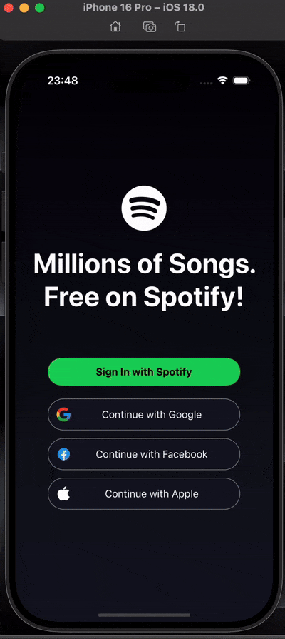

# Spotify Clone - React Native

A Spotify Clone project developed using React Native to replicate the core functionalities and design of the Spotify app. This is a learning project to enhance mobile development skills and understand modern application architecture.

## Features

- User-friendly interface inspired by Spotify.
- Browse and play music tracks.
- Dynamic navigation between screens.
- Integration with API or mock data for fetching song details.

## Technologies Used

- **React Native**: For building the mobile application for both iOS and Android platforms.
- **Redux or Context API**: For state management to handle global application data. _(If applicable)_
- **React Navigation**: For screen transitions and navigation within the app.
- **Spotify API or Mock Data**: To fetch music data and simulate Spotify functionalities.
- **Styled Components or Tailwind CSS**: For customizable and reusable styling. _(If applicable)_
- **Axios or Fetch**: For API requests to fetch and send data.
- **Expo**: To simplify and accelerate the development process. _(If applicable)_

```

```


